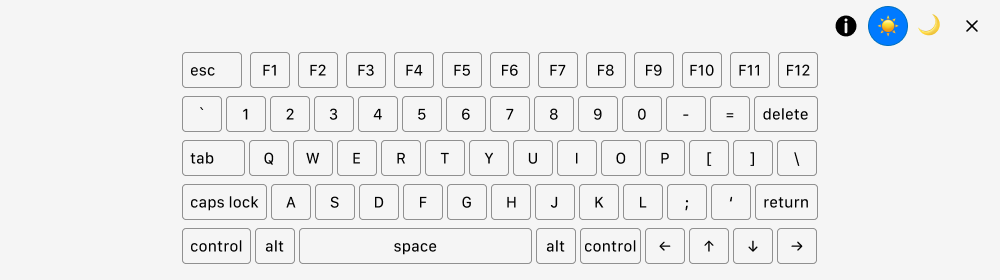
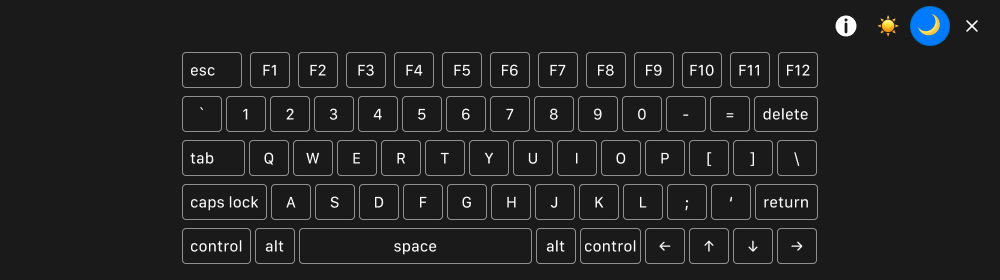

# Keyboard Demo Tool

A browser bookmarklet that displays a visual keyboard overlay, highlighting keys in real-time as you press them.

**Version:** 0.12 | **License:** MIT

## What is this?

Keyboard Demo Tool is a lightweight, free bookmarklet for demonstrating keyboard functionality and navigation on websites. It adds a persistent keyboard visualization at the bottom of any webpage, showing exactly which keys are being pressed in real-time.

## Use cases

- **Accessibility training** - Demonstrate keyboard navigation patterns for web accessibility education
- **Video tutorials** - Show keyboard interactions clearly in screen recordings
- **Live presentations** - Display keyboard shortcuts during training sessions or demos
- **Accessibility audits** - Document keyboard navigation behavior during website evaluations
- **Stakeholder demos** - Present keyboard accessibility features to clients and teams
- **User testing** - Record and document keyboard interaction patterns
- **Technical documentation** - Create visual guides for keyboard shortcuts and navigation

## Features

* Real-time visualization: Keys light up as you press them, showing your audience exactly what you're doing
* Cross-browser bookmarklet: Works on Safari, Chrome, and Firefox without installation
* Keyboard shortcut to close bookmarklet:
   * Mac: option+\
   * Windows/Linux: Alt+\
* Keyboard shortcut to toggle between light and dark modes:
   * Mac: option+K
   * Windows/Linux: Alt+K
* Light & dark mode: Toggle themes to match your preferences
* Intelligent keyboard layout: Auto-detects whether you're on Mac or Windows/Linux and displays the appropriate keyboard, with option to toggle between layouts
* Zero installation - works as a browser bookmark
* Privacy-first - no data collection, fully client-side

## Browser compatibility

- Safari (latest versions)
- Chrome (latest versions)
- Firefox (latest versions)

**Note:** This tool cannot run on sites with strict Content Security Policies (CSP), including YouTube, Gmail, Google Docs, social media platforms, and banking sites. This is a technical limitation of bookmarklets.

## Installation

**[Install Keyboard Demo Tool](https://lindadesign.net/bookmarklet-keyboard-demo/)**

## How to use

1. **Open a webpage** where you want to demonstrate keyboard navigation (note: does not work on sites with strict Content Security Policies - see Browser Compatibility section)
2. **Click the bookmarklet** in your bookmarks bar to activate the keyboard visualizer
3. **Type on your keyboard** - keys will highlight in real-time
4. **Toggle between light and dark themes** using the theme buttons or keyboard shortcut (option+K on Mac, Alt+K on Windows/Linux)
5. **Close the visualizer** with the close button or keyboard shortcut (option+\ on Mac, Alt+\ on Windows/Linux)

**Keyboard shortcuts:**
- Close: Alt+\ (Windows/Linux) or option+\ (Mac)
- Toggle theme: Alt+K (Windows/Linux) or option+K (Mac)

## What is a bookmarklet?

A bookmarklet is a bookmark that runs JavaScript code instead of opening a webpage. You store it in your browser's bookmarks bar like any other bookmark, but when you click it, it executes code on whatever page you're currently viewing.

Bookmarklets can modify pages, extract data, or add functionality to your browser without requiring browser extensions or installations. They use `javascript:` URLs instead of regular `http://` or `https://` URLs.

**Learn more:** [Bookmarklet on Wikipedia](https://en.wikipedia.org/wiki/Bookmarklet)

## Contributing

### Contribution guidelines

- Test your changes on multiple browsers
- Verify the bookmarklet works on various websites
- Maintain accessibility features (ARIA labels, keyboard navigation)
- Keep code clean and well-commented
- Follow existing code style and conventions
- Update documentation if adding new features

## License

This project is licensed under the MIT License - see the [LICENSE](LICENSE) file for details.

**TL;DR:** Free to use, modify, and distribute. Attribution appreciated but not required.

## Author

Created and maintained by **Linda Nakasone**

- Website: [lindadesign.net](https://lindadesign.net)
- Support: Contact information available on website